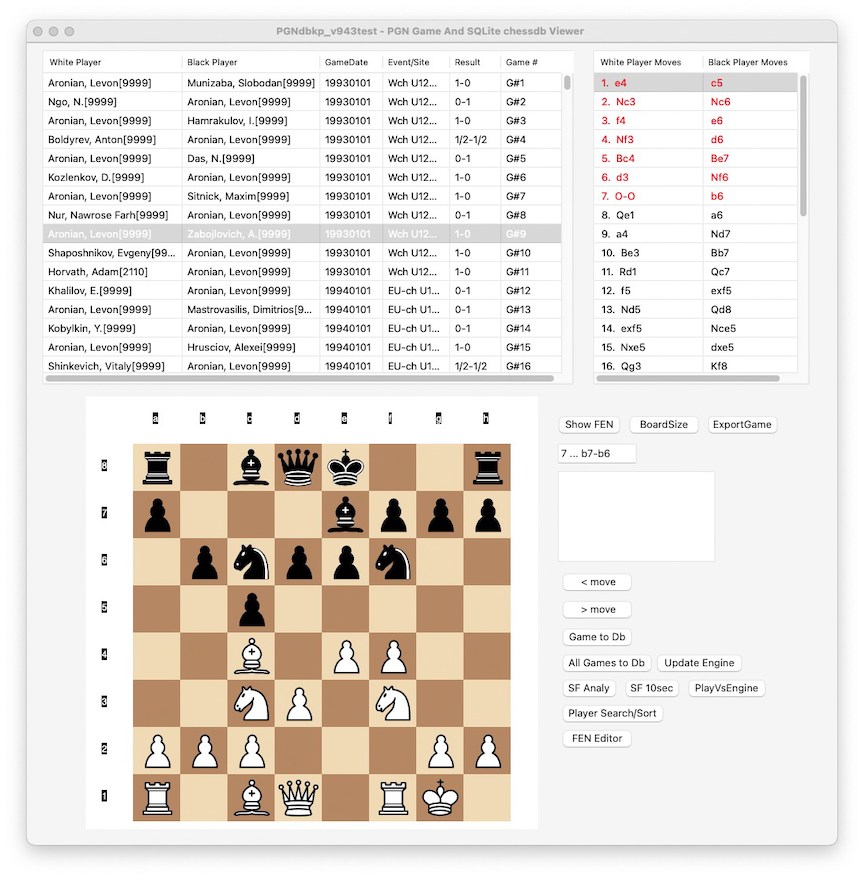
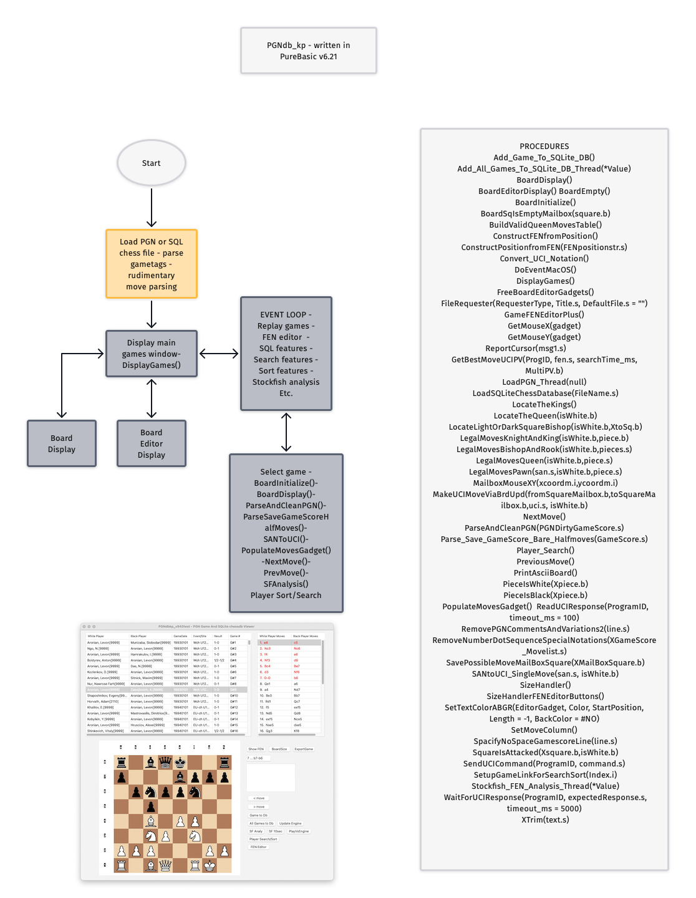

  

  <h3>PGNdbkp</h3>

  PGNdbkp is a free for personal use SAN-UCI chess PGN viewer and SQLite chess database
  written in PureBasic 6.21.
   
  
   
  
  

  
   
  

## Overview

[PGNdbkp][https://github.com/kenpchess/PGNdbkp_master] is a free for personal use
SAN-UCI chess PGN viewer and SQLite chess database.

PGNdbkp  includes a graphical user interface (GUI) that displays the
chessboard and makes it easy to view or replay moves. This program is considered
somewhat didatic in that it demonstrates several features of PureBasic 6.21,
including event loops, threads, various gadgets, SQLite interface to PureBasic
6.21, auto-resizing of gadgets and other PureBasic 6.21 features. This application
is not completely loaded with sophisticated code but does showcase many nice
features of PureBasic 6.21 including enumeration, postevents, binary data
encapsulation, conditional compilation, RunProgram for launching external 
binaries, and several others. Refer also to the source code as it is quite 
liberally commented.

The main Features of PGNdbkp are :

  * Reads most SAN or UCI PGN gamefiles. It attempts to remove all comments
    and variations, although not 100% perfect. I would suggest using the
    excellent pgn-extract utility (https://github.com/kentdjb/pgn-extract/
    or https://www.cs.kent.ac.uk/people/staff/djb/pgn-extract/) to fully
    clean any PGN files you find troublesome. (A command such as:
    pgn-extract -C -V input.pgn --output cleaned.pgn should work fine).
    
  * PGNdbkp also reads and writes an SQLite database file of its' own 
    simple format.
    
  * Allows game export (all games or current game) to SQLite database file.
  
  * Allows current game to be exported to a single-game PGN gamefile textfile.
  
  * Stockfish or UCI engine interaction. Allows chess engine to analyze moves
    or positions. The default engine location is updatable.
    
  * Play a game directly against Stockfish or another UCI engine.
  
  * PLayer search/sort options to sort all games or search for the
    games of a specific player.
    
  * Basic FEN position GUI chessboard editor. Utilizes point-and-click
    GUI to edit games or setup positions.
    
  * Board size option for small or medium-size chessboard.
  
  * GUI allows main window resizing (limited) and allows using arrow-keys
    for move traversal.

## Files

This distribution of PGNdbkp consists of the following files:

  * [README.md][readme-link], the file you are currently reading.

  * [CC-NC_license.txt], a text file containing the CC BY-NC
    License version 4.

  * [PGNdbkp_yyyymmdd.pb],  main PureBasic file containing the full source 
    code, approximately 4000 lines, with about 60 procedures.
  
  * [images], chess piece image files.
  
  * [PGNs], sample PGN files to view and enjoy.
  
  * [PGNdbkp_yyyymmdd_macos], macos executable binary compiled under
    PureBasic 6.21 on macos sequoia 15.6.
    
  * [PGNdbkp_yyyymmdd_win.exe], windows 10-11 executable binary compiled
    under PureBasic 6.21 via wine emulation.
    
  * [PGNdbkp_flowchart1.png], general flow diagram of PGNdbkp_yyyymmdd
  
  * [PGNdbkp_20250807.png], png screenshot of PGNdbkp_yyyymmdd
  
  * [chesspgn_db_human2600elo.sqlite], sample SQLite chess database
    created by PGNdbkp_yyyymmdd.
    
  * [PGNdbkp_*.png], miscellaneous screenshots of PGNdbkp_yyyymmdd.
  
  

## Compiling PGNdbkp

PGNdbkp has support for 64-bit CPUs, modern hardware instructions, and various platforms.

On MacOS or Windows 10-11 systems, it should be easy to compile PGNdbkp directly from the
source code with the PureBasic 6.21 compiler or later. 

## Terms of use

PGNdbkp chess utility  © 2025 by kenpchess is licensed under CC BY-NC 4.0. 
To view a copy of this license, visit https://creativecommons.org/licenses/by-nc/4.0/

The main limitation for the CC BY-NC 4.0 license is that you cannot use PGNdbkp in any 
commercial fashion and you MUST always include the license and the full source code to PGNdbkp.

## Acknowledgements

PGNdbkp uses code snippets provided as examples from the PureBasic forum. See the source
code for additional attribution.

[authors-link]:       https://github.com/official-PGNdbkp/PGNdbkp/blob/master/AUTHORS
[commits-link]:       https://github.com/official-PGNdbkp/PGNdbkp/commits/master
