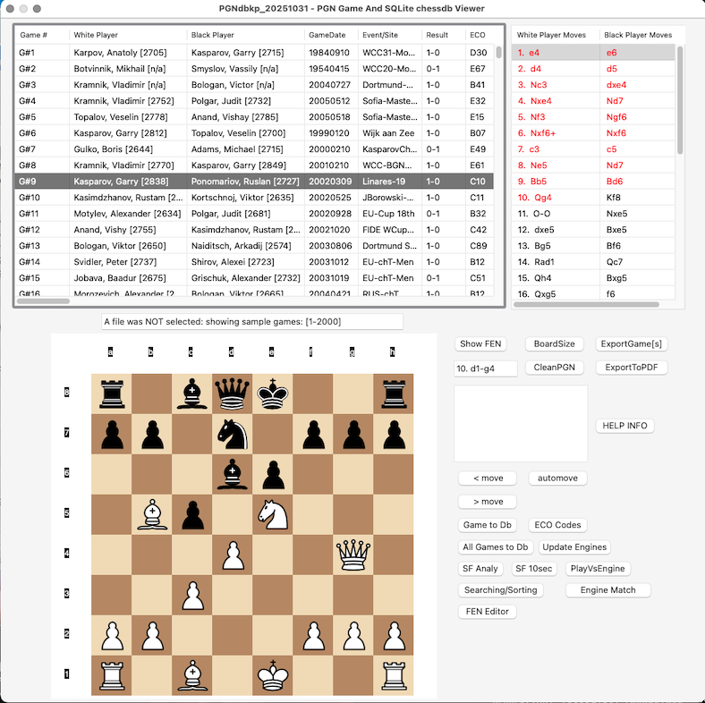
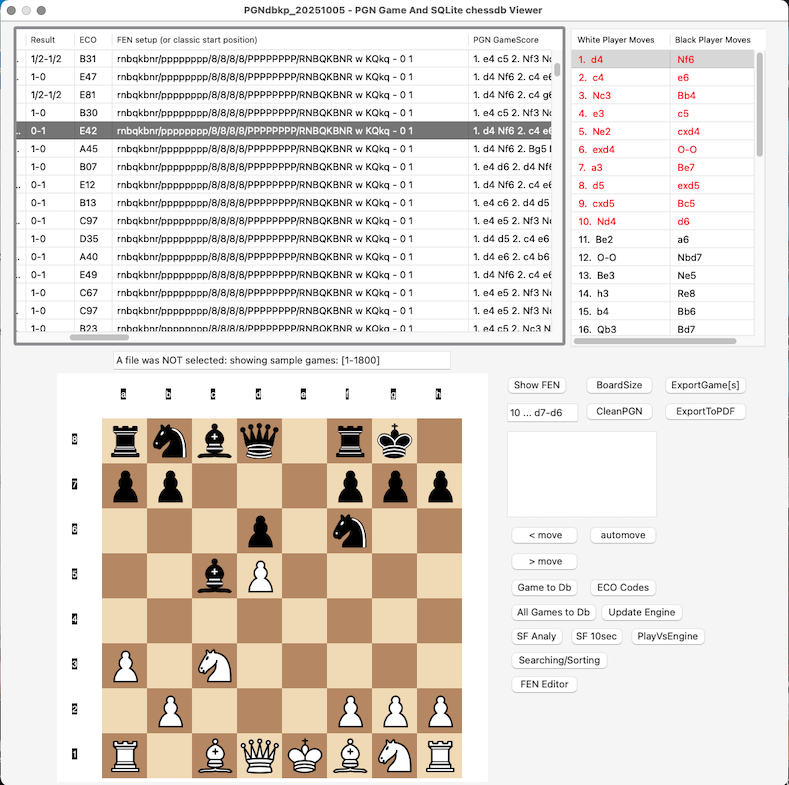
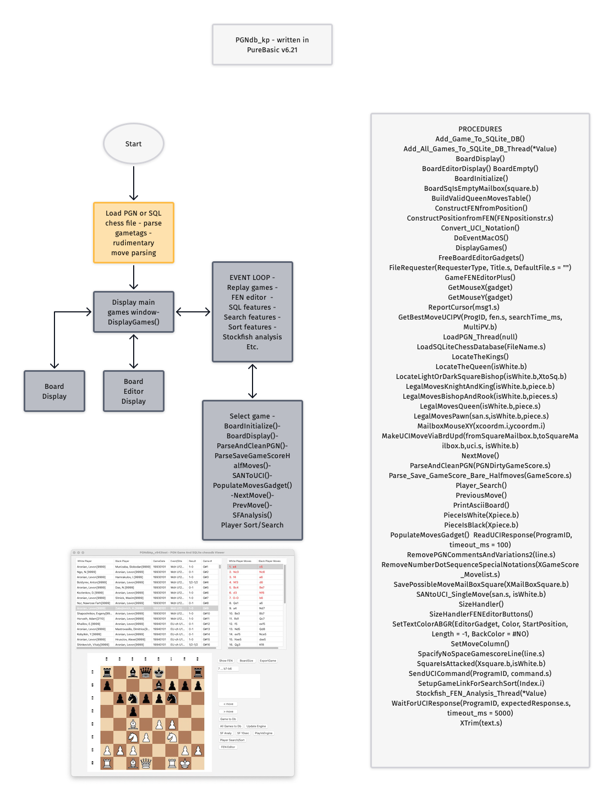

  

  <h3>PGNdbkp</h3>

  PGNdbkp is a free for personal use SAN-UCI chess PGN viewer and SQLite chess database
  written in PureBasic 6.21.
   
  
   
  
  

  
   
  
  
  
  
  
   
  

## Overview

[PGNdbkp][https://github.com/kenpchess/PGNdbkp_master] is a free for personal use
SAN-UCI chess PGN viewer and SQLite chess database.

PGNdbkp  includes a graphical user interface (GUI) that displays the
chessboard and makes it easy to view or replay moves. This program is considered
somewhat didatic in that it demonstrates several features of PureBasic 6.21,
including event loops, threads, various gadgets, SQLite interface to PureBasic
6.21, auto-resizing of gadgets and other PureBasic 6.21 features. This application
is not a total example of sophisticated code but does showcase many nice
features of PureBasic 6.21 including enumeration, postevents, binary data
encapsulation, conditional compilation, RunProgram for launching external 
binaries, and several others. Refer also to the source code as it is quite 
liberally commented.

The main Features of PGNdbkp are :

  * Reads most SAN or UCI PGN gamefiles. It attempts to remove all comments
    and variations, although not 100% perfect. I would suggest using the
    excellent pgn-extract utility (https://github.com/kentdjb/pgn-extract/
    or https://www.cs.kent.ac.uk/people/staff/djb/pgn-extract/) to fully
    clean any PGN files you find troublesome. (A command such as:
    pgn-extract -C -V input.pgn --output cleaned.pgn should work fine).
    
  * PGNdbkp also reads and writes an SQLite database file of its' own 
    simple format.
    
  * Allows game export (all games or current game) to SQLite database file.
  
  * Allows the current game or a range of games to be exported to a PGN 
    gamefile textfile, including ascii diagrams and engine analysis.
    
  * Allows the current game or a range of games to be exported to a PDF
    file(s) with graphic board diagrams (smaller version of on-screen
    chessboard) and engine analysis. These are essentially make-your-own
    PDF chessbooks (only partially working under Windows, still a work
    in progress!). Note that each analyzed game will be output to a
    separate pdf file.
  
  * Stockfish or UCI engine interaction. Allows chess engine to analyze moves
    or positions. The default engine location is updatable. On MacOs make
    sure you have your "Security Preferences" set to allow Stockfish
    to run. MacOs blocks most "outsider" downloads like Stockfish until
    you tell it otherwise.
    
  * Play a game directly against Stockfish or another UCI engine.
  
  * Player/moves search/sort options to sort all games, search for the
    games of a specific player, sort by ECO code, or search for specific 
    move sequences such as "1. e4 e5 2. Nf3 Nc6 3. Bc4" or even iconic sacrifice
    moves such as simply Bxh7+. You can also filter games for material
    sacrifices of a specified amount between one and nine pawns.
    
  * Basic FEN position GUI chessboard editor. Utilizes point-and-click
    GUI to edit games or setup positions. FEN starting positions (if any)
    can now also be viewed by right-scrolling in the games window.
    
  * Board size option for small or medium-size chessboard.
  
  * Allows for somewhat limited engine matches (26-engines, round-robin or 
    gauntlet). The new engine match feature is primarily for entertainment 
    purposes and is not (yet) designed for serious engine matches or for 
    statistical purposes. The engine match feature has a self-contained  
    opening lines book of about 20000 openings. Now allows an "engine_list.txt"
    file to hold a list of the engine match engines. Also allows an external
    opening book file with up to 20000 additional opening lines [book files
    are 80-character 16-ply UCI compliant text files].
  
  * GUI allows main window resizing (limited) and allows using arrow-keys
    and shift-arrow-keys for move traversal. You may also use the "automove"
    button to automatically replay the entire game [press the escape-key
    for about two seconds to stop "automove" replay]. You may right-scroll
    in the games window to view all raw movelists and any FENs.
    
  * The current gamescore limit for PGNdbkp is set at 200,000 games via
    the #game_max constant at the top of the source file. You can of
    course increase this limit and re-compile your own version if you
    have the memory. PGNdbkp uses about 200mb of memory (all games are
    stored in memory) for every 100,000 games in the PGN input file.
    The above-mentioned pgn-extract utility is one such utility that
    allows you to split very large PGN files into any number of smaller
    files.
    
  * There are a few "Easter Egg" features if you look at the source code.
    One such feature is if you choose "cancel" at the file-open dialog
    instead of selecting a PGN file, you will be presented with some
    nice built-in sample chess games to view (currently about 15000 games).
    
  * There are also some additional pgn utilities in the [UTILITIES] folder.
    This includes MiniGUI4PgnExtract, which is a small GUI overlay for some
    of the functions of the great PGN-Extract utility.
    
  * It should probably be noted that PGNdbkp runs more smoothly on MacOs
    than Windows primarily because 90% of the coding and debugging were
    done on MacOS. Also some features of PureBasic are implemented
    differently on the two platforms, which necessitated different
    coding approaches for the two platforms.
    
  * There are almost certainly still software bugs in this program!
    Reported bugs will probably be fixed but not in any particular
    timeframe. The author (me) is a retired 72 year-old gentleman
    with only so much time and energy! Thank you!
    
  * Although PGNdbkp is totally free for personal use, if you find it
    useful and would like to send me a small PayPal donation, it would
    be most appreciated! My PayPal donation link is:
    [https://paypal.me/kenpresley?locale.x=en_US&country.x=US]
    

## Files

This distribution of PGNdbkp consists of the following files:

  * [README.md][readme-link], the file you are currently reading.

  * [CC-NC_license.txt], a text file containing the CC BY-NC
    License version 4.

  * [PGNdbkp_yyyymmdd.pb],  main PureBasic file containing the full source 
    code, approximately 4000 lines, with about 60 procedures.
  
  * [images], chess piece image files.
  
  * [PGNs], sample PGN files to view and enjoy.
  
  * [PGNdbkp_yyyymmdd_macos], macos executable binary compiled under
    PureBasic 6.21 on macos sequoia 15.6.
    
  * [PGNdbkp_yyyymmdd_win.exe], windows 10-11 executable binary compiled
    under PureBasic 6.21 via wine emulation.
    
  * [PGNdbkp_flowchart1.png], general flow diagram of PGNdbkp_yyyymmdd
  
  * [PGNdbkp_20250807.png], png screenshot of PGNdbkp_yyyymmdd
  
  * [chesspgn_db_human2600elo.sqlite], sample SQLite chess database
    created by PGNdbkp_yyyymmdd.
    
  * [PGNdbkp_*.png], miscellaneous screenshots of PGNdbkp_yyyymmdd.
  
  * [16ply_openings_20000_spaces.pb], opening sequences file.
  
  * [eco_name_pgn_fen.pb], standard ECO opening classifications file.
  
  * [MiniGUI4PgnExtract], the small GUI overlay for PGN-Extract.
  
  

## Compiling PGNdbkp

PGNdbkp has support for 64-bit CPUs, modern hardware instructions, and various platforms.

On MacOS or Windows 10-11 systems, it should be easy to compile PGNdbkp directly from the
source code with the PureBasic 6.21 compiler or later. 

## Terms of use

PGNdbkp chess utility  © 2025 by kenpchess is licensed under CC BY-NC 4.0. 
To view a copy of this license, visit https://creativecommons.org/licenses/by-nc/4.0/

The main limitation for the CC BY-NC 4.0 license is that you cannot use PGNdbkp in any 
commercial fashion and you MUST always include the license and the full source code to PGNdbkp.

## Acknowledgements

PGNdbkp uses code snippets provided as examples from the PureBasic forum. See the source
code for additional attribution.

[authors-link]:       https://github.com/official-PGNdbkp/PGNdbkp/blob/master/AUTHORS
[commits-link]:       https://github.com/official-PGNdbkp/PGNdbkp/commits/master
